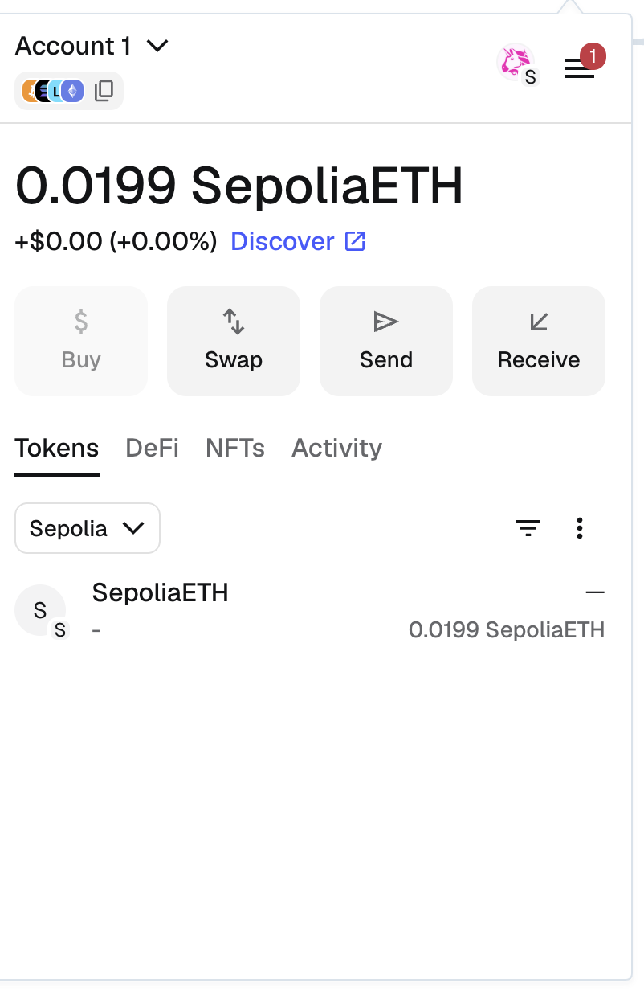
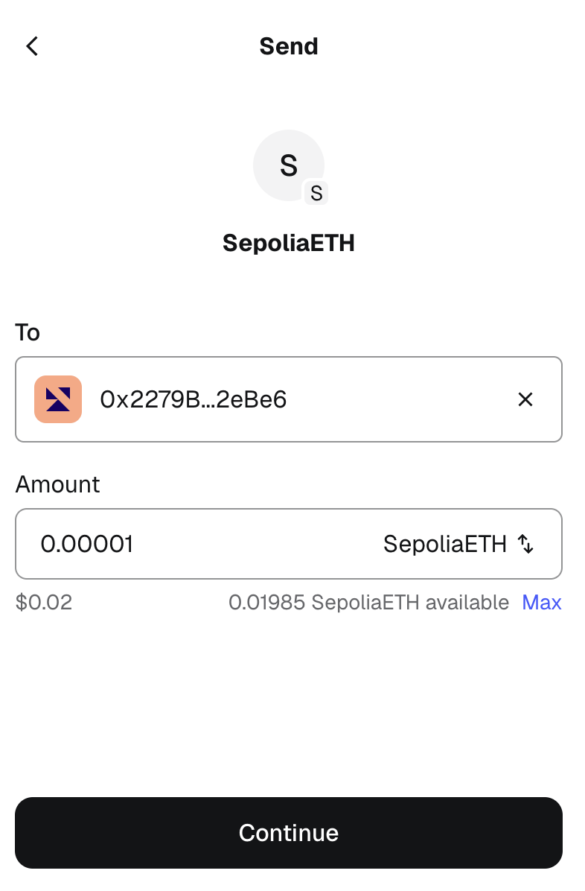
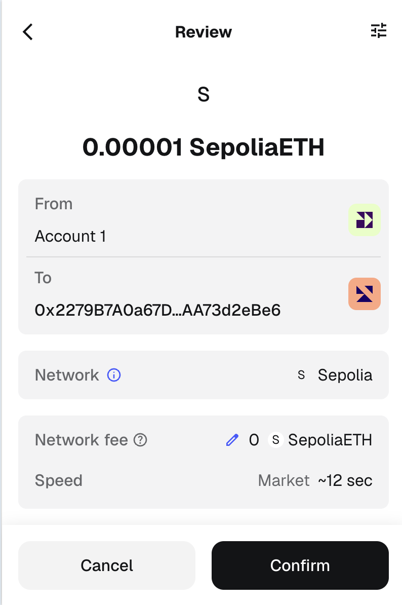
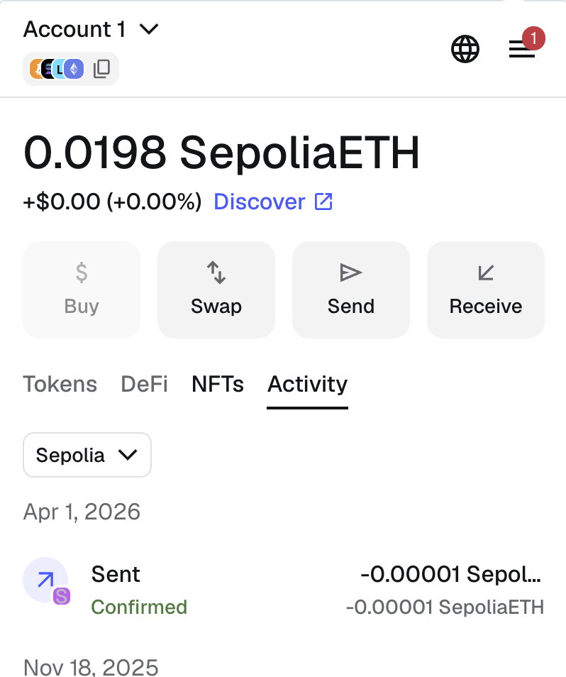

# HW16 — UX-анализ MetaMask

## Пользовательский поток: отправка Sepolia ETH

### Шаг 1. Установка и создание кошелька

Расширение MetaMask из Chrome Web Store. 
При первом запуске:
- **Create a new wallet** — генерация нового кошелька с seed-фразой 
- **Import an existing wallet** — восстановление кошелька по seed-фразе

После создания пароля и записи seed-фразы кошелёк готов к использованию.

### Шаг 2. Инициация отправки ETH

Для отправки ETH пользователь открывает расширение MetaMask и нажимает кнопку **Send**:
1. Вводит адрес получателя (0x...) или выбирает из списка контактов
2. Указывает сумму в ETH (или в фиатном эквиваленте)
3. Нажимает **Next** для перехода к подтверждению

### Шаг 3. Настройка газа и подтверждение

На экране подтверждения MetaMask отображает:
- **Адрес получателя** — сокращённый hex-адрес
- **Сумма** — количество ETH к отправке
- **Estimated gas fee** — оценка комиссии сети с тремя вариантами: Low, Market, Aggressive
- **Total** — общая сумма (отправка + газ)

Доступны две кнопки:
- **Reject** — отмена транзакции
- **Confirm** — подтверждение и отправка в сеть

### Шаг 4. Ожидание и результат транзакции

После нажатия **Confirm**:
1. Транзакция отправляется в сеть Ethereum
2. В расширении появляется статус **Pending** с иконкой загрузки
3. После включения транзакции в блок статус меняется на **Confirmed** (зелёная галочка) или **Failed** (красный крестик)
4. В разделе **Activity** сохраняется запись о транзакции со ссылкой на блок-эксплорер (Etherscan)

---

## UX-проблемы

### Проблема 1. Создание нового кошелька

Если создать кошелек и выйти из аккаунта, то будет кнопка `Unlock` и `Forgot Password`, чтобы создать новый надо идти в `Forgot Password`, выбирать, что не помнишь фразу для восстановлени и тогда предложать создать новый.

### Проблема 2. Задание nickname

Задать nickname можно при переводе денег кликнув на адрес, но это не явно не обозначеное.

---

## Предложения по улучшению

### Улучшение 1. Создание нового кошелька

Добавить кнопку для создания кошелька, при нажатии подтверждение что локальные данные будут удалены, но деньги в текущем кошельке останутся.

### Улучшение 2. Задание nickname

Если nickname не задан, то можно рядом адресом (выше/ниже) показвать иконку или текст "Set Nickname", места на окне достаточно.