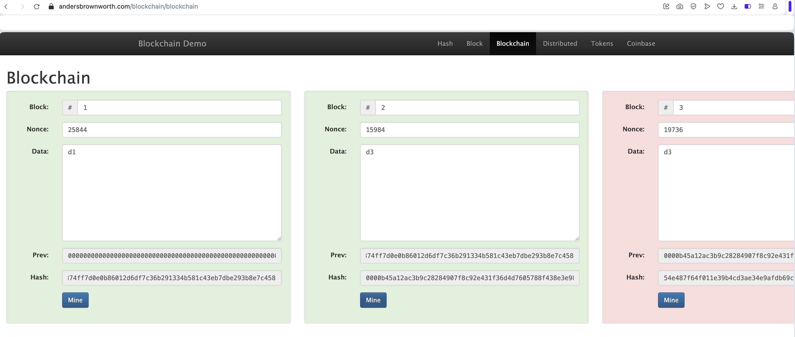

# HW2 - Исследование и сравнение алгоритмов консенсуса (PoW, PoS, DPoS)

## Proof of Work

Когда изменяются данные в блоке, его hash меняется - вычисляется на основе содержимого блока.
Из-за этого следующие блоки становятся недействительными,
так как в них хранится старый hash предыдущего блока.
Чтобы восстановить цепочку, нужно выполнить Proof of Work и пересчитать hash каждого последующего блока.

## Proof of Stake
Чтобы стать валиадтором Ethereum нужно иметь минимальный порог для запуска собственного узла — 32 ETH.

Принцип выбора валидатора в PoS - валидатор выбирается случайно (например на основе объема, возраста стейка).

## Сравнение алгоритмов консенсуса: PoW, PoS и DPoS

| Критерий                 | PoW                                                     | PoS                                                       | DPoS (Delegated Proof of Stake)                                      |
|--------------------------|----------------------------------------------------------|-----------------------------------------------------------|------------------------------------------------------------------------|
| Скорость                 | Низкая - сложные вычисления.                        | Высокая - быстрый и простой выбор валидатора.               | Очень высокая, так как блоки создают избранные делегаты.             |
| Безопасность             | Высокая из-за сложных вычислений, нужно контролировать более 50% мощности сети, чтобы  подделать блок.          | Высокая при большом количестве валидаторов.               | Средняя: есть зависимоть от ограниченного числа делегатов.         |
| Устойчивость к атакам    | Хорошая, зависит от распределения майнеров (атака 51%).| Высокая: атака требует большого стейка.                  | Ниже: возможен сговор делегатов или влияние на выбор делегатов.            |
| Требования к оборудованию| Очень высокие (ASIC/GPU).                               | Низкие: нужен стандартный сервер.                         | Очень низкие: оборудование нужно делегатам, не требуется мощное оборудование.            |

## Вывод

**PoS выглядит наиболее перспективным**, поскольку сочетает энергоэффективность, безопасность, децентрализацию и хорошие возможности масштабирования. Не создается сильной централизации, как в DPoS, и не нужно большого энергопотребления, как в PoW. DPoS как вариант будет лучше при условии непредвзятости делегатов и корректности их выбора.