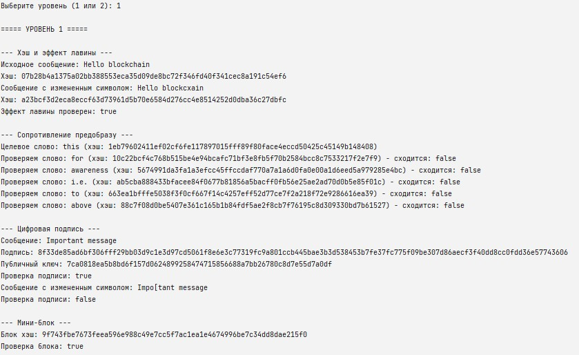
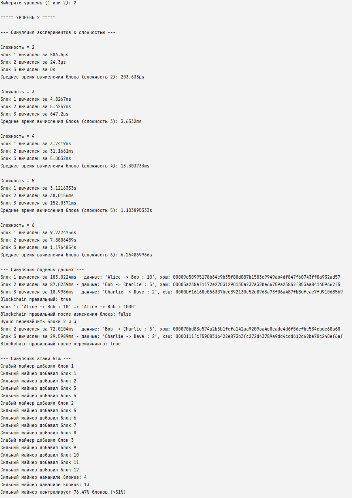

# HW4 - Криптография и безопасность в блокчейне

## Запуск

* Установите [GO](https://go.dev/doc/install)
* Выполните `go run .`
* При выводе `Выберите уровень (1 или 2):` введите 1 или 2 и нажмите `Enter` 

## Уровень 1

Хэши позволяют хранить данные безопасно, эффективно:

- Экономия: вместо самих данных сохраняется хэш и выполняются действия с ним.
- Защита/безопасность: данные невозможно изменить, не изменив хэш.
- Хэш не раскрывает исходные данные.
- Одинаковые данные порождают одинаковый хэш.

Цифровые подписи позволяют подтвердить подлинность данных и их источника (автора) - 
обеспечивают невозможность подделки без приватного ключа.

Основные угрозы включают подмену данных, подделку транзакций и атаки на консенсус.
Хэши противостоят подмене данных - любое изменение нарушает цепочку блоков.  
Подписи защищают от несанкционированных изменений и подлога.
Доказательство работы усложняет атаки за счёт вычислительных затрат нужных на вычисление/манинг.

## Пример работы

## Уровень 2

## Вычисление блоков с разной сложностью

| Сложность | Блок 1        | Блок 2        | Блок 3       | Среднее время блока       |
|-----------|---------------|---------------|--------------|--------------------------|
| 2         | 586.6 µs      | 24.3 µs       | 0 s          | 203.633 µs               |
| 3         | 4.8267 ms     | 5.4257 ms     | 647.2 µs     | 3.6332 ms                |
| 4         | 3.7419 ms     | 31.1661 ms    | 5.0032 ms    | 13.303733 ms             |
| 5         | 3.1216333 s   | 38.0156 ms    | 152.0371 ms  | 1.103895333 s            |
| 6         | 9.7374756 s   | 7.8806489 s   | 1.1764854 s  | 6.264869966 s            |

## Атака 51 %
Cимулируются два майнера с разной вычислительной мощностью. Майнер, обладающий более чем 51 %
мощности чаще формирует более длинную цепочку и может навязывать её сети.

Мера противодействия: децентрализация вычислительной мощности и экономическая сотимость.
В сетях высокая стоимость атаки и распределение майнеров позволяют снизить возможность концентрацию мощности.

## Подмена данных в старом блоке
Cодержимое одного из ранних блоков цепочки меняется, после этого проверка целостности цепочки не проходит.

Мера противодействия: использование Proof-of-Work и глубина цепочки.
Чем глубже блок в цепочке, тем дороже его подмена, так как требуется перемайнинг всех последующих блоков.

## Пример работы

