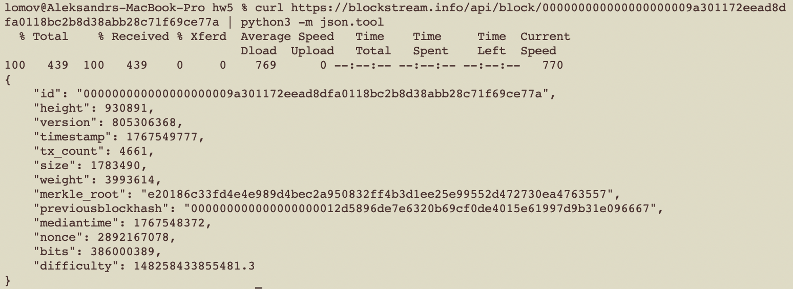
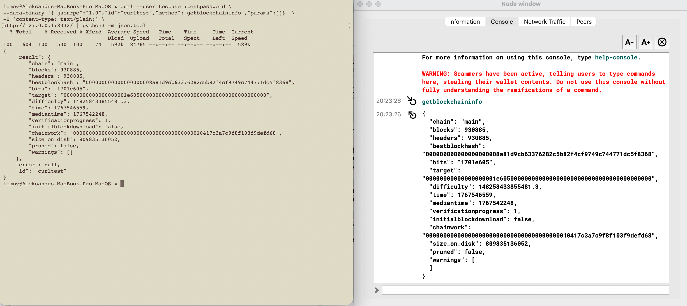
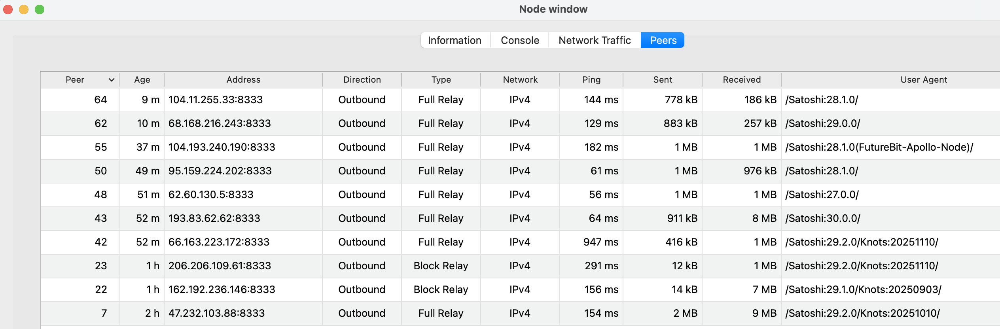
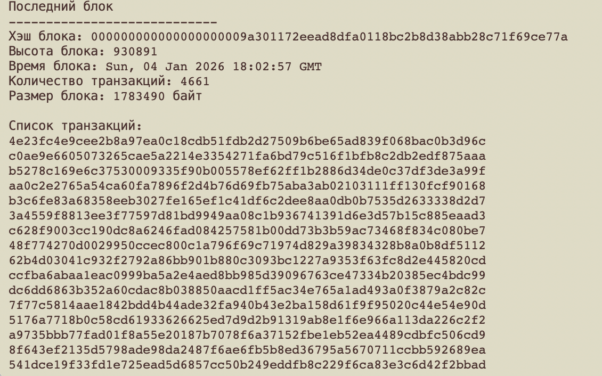
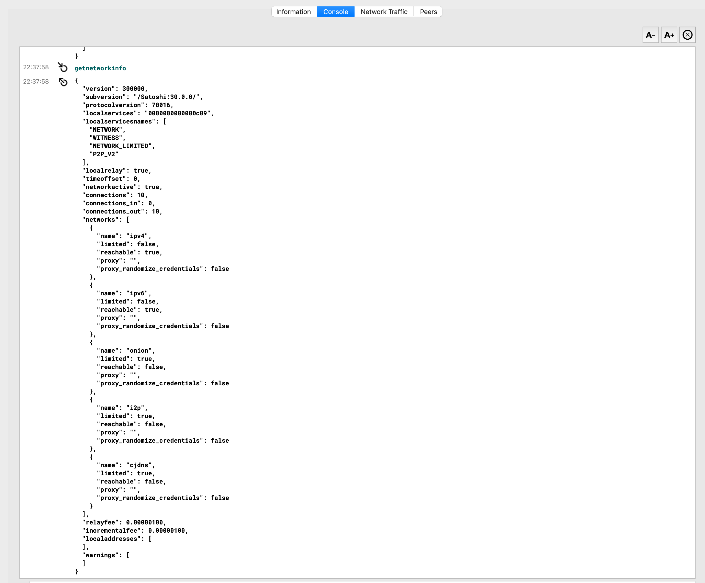
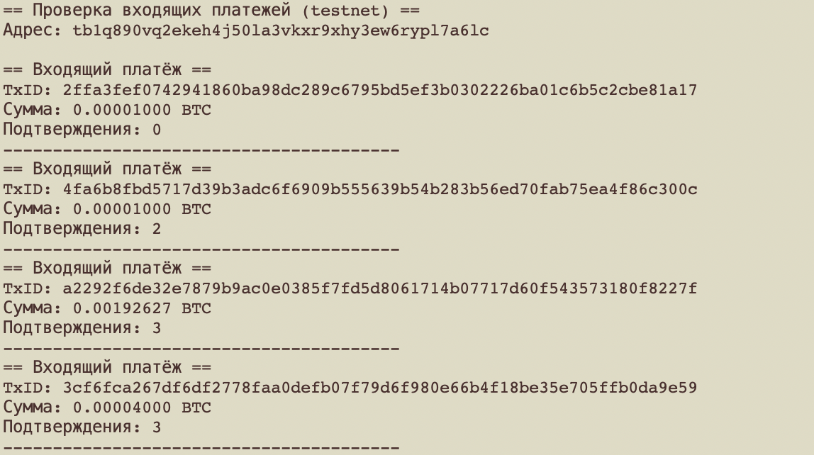
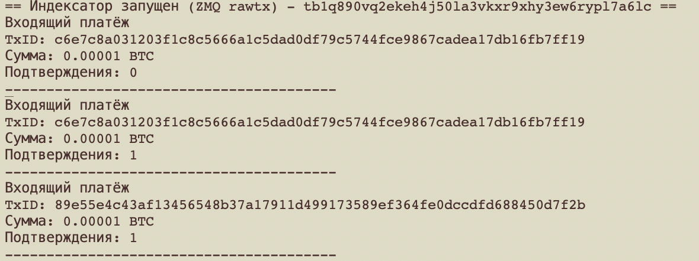

# HW5 - Взаимодействие с Bitcoin

## 1 - Выбор и настройка подключения

### Уровень 1
Ипользуется `Blockstream Esplora`

```
curl https://blockstream.info/api/block/000000000000000000009a301172eead8dfa0118bc2b8d38abb28c71f69ce77a | python3 -m json.tool
```



### Уровень 2



## 2 - Исследование функциональности

### Функции узла Bitcoin
1. Проверка транзакций  
Узел принимает транзакции от кошельков и других узлов сети и выполняет проверку (формат, подписи, соответсвия консенсусу)
2. Валидация блоков  
Каждый новый блок от пиров, проходит полную проверку (соответствие заголовка блока правилам сети,
корректность всех транзакций внутри блока, соблюдение правил награды майнеру).
Блоки, не прошедшие валидацию, отклоняются и не добавляются в локальную копию блокчейна.
3. Mempool - локальное хранилище неподтверждённых транзакций узла.  
Содержит транзакции, прошедшие проверку, но не включённые в блок. 
Очищается при включении транзакций в блоки или при истечении времени хранения.
4. Пиры (Peers)  
Узел Bitcoin поддерживает соединения с другими узлами сети — пирами:
устанавливает соединения; обменивается блоками и транзакциями; обеспечивает децентрализацию сети.

### Уровень 2
Время синхронизации: около 32 часов



## 3 - Взаимодействие через JSON-RPC/API

### Последний блок

```
node lastblock.js
```



### Уровень 2



## 3 - Разработка индексатора платежей
Кошелек в testnet: tb1q890vq2ekeh4j50la3vkxr9xhy3ew6rypl7a6lc

```
node indexer.js
```


### Уровень 2

Добавить в `bitcoin.conf`

```
zmqpubrawtx=tcp://127.0.0.1:28332
zmqpubrawblock=tcp://127.0.0.1:28333
```

```
npm install zeromq node-fetch
node zmqindexer.mjs
```


## 4 - Оптимизация и анализ

### Уровень 2: настройте pruning, dbcache, maxconnections. Опишите результаты и экономию ресурсов.

#### Pruning
Включает режим хранения неполной копии блокчейна. 
Храняться последние блоки. 
Старые данные удаляются после их проверки.

Позволяет экономить дисковое пространтсво.

После синхронизации `mainnet` размер составлял 754,5G.  
Не хватало для синхронизации `testnet`.
Псоле установивки `Pruning` на 500G (`testnet` = 488,5G), появилась возможность синхронизаировать `testnet`. 

#### Dbcache (кэш базы данных)
Задаёт объём оперативной памяти, выделяемой под кэш.  
Позволяет повысить скорость синхронизации скорость обработки блоков и транзакций.

#### Maxconnections (ограничение пиров)
Ограничивает максимальное количество сетевых соединений с другими узлами.
Позволяет снизить сетевую нагрузку и потребление памяти.
