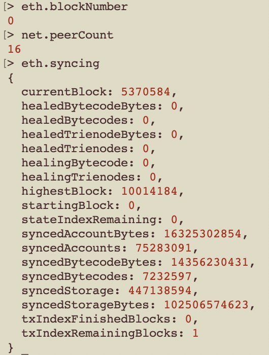
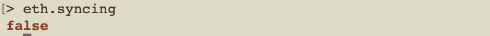
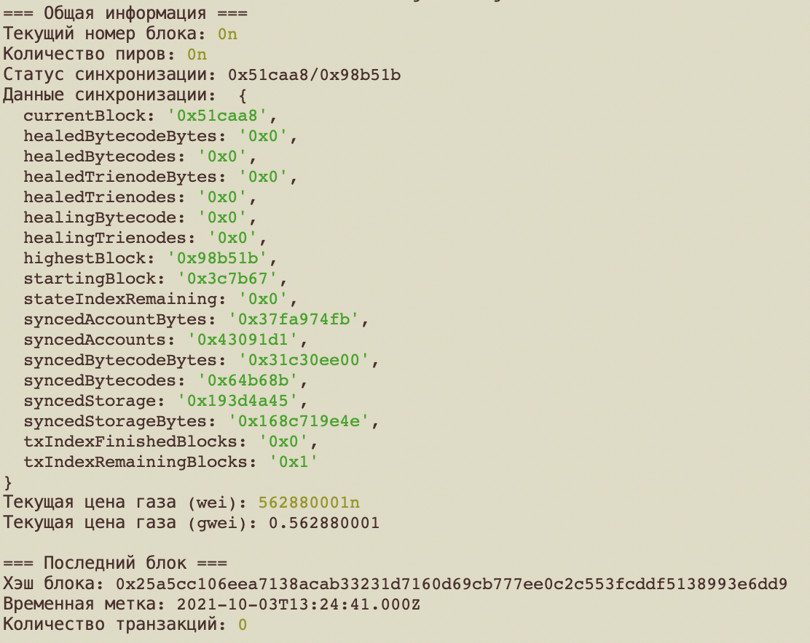
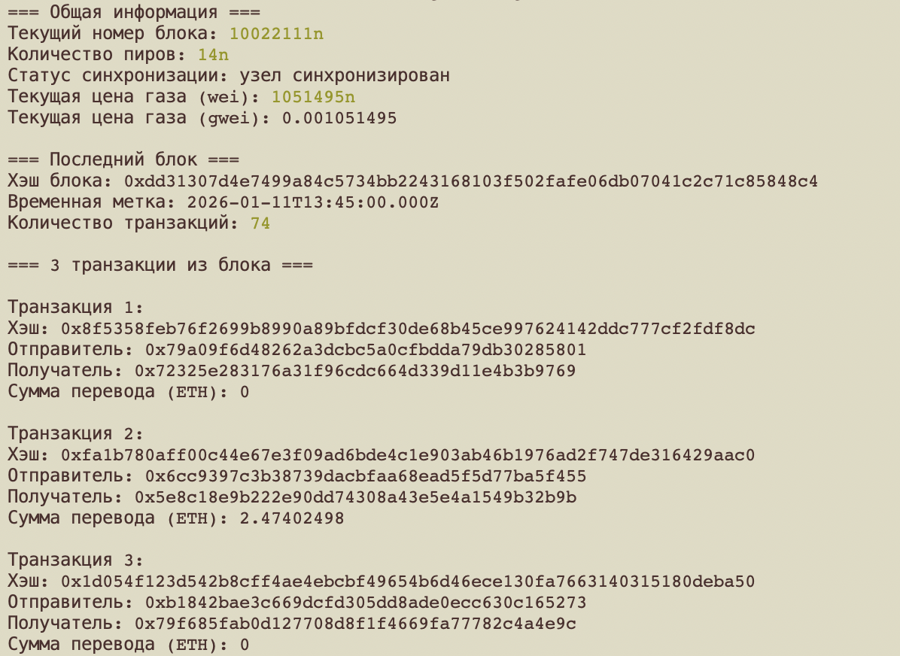

# HW6 - Запуск и базовое взаимодействие с узлом Ethereum

## Установка компонентов на Mac

**Geth**:
```
brew install ethereum
```

**Prism**:
```
mkdir ~/.ethereum/consensus
mkdir ~/.ethereum/execution
cd ~/.ethereum/consensus

curl https://raw.githubusercontent.com/prysmaticlabs/prysm/master/prysm.sh --output prysm.sh && chmod +x prysm.sh
```

Гереация токена для аутентификации:
```
./prysm.sh beacon-chain generate-auth-secret
mv jwt.hex ../
```

## Запуск локального узла и синхронизации

**Geth**:
```
geth --sepolia --syncmode snap --http --http.api eth,net,web3 --http.corsdomain "*" --http.vhosts "*"  --authrpc.jwtsecret=<path-to-jwt-token>
```

**Prism**:
```
cd ~/.ethereum/consensus
./prysm.sh beacon-chain --sepolia --jwt-secret=<path-to-jwt-token> --checkpoint-sync-url=https://sepolia.beaconstate.info
```

### Проверка

```
geth attach
```

**До завершения синхронизации**:



**После завершения синхронизации**:



## Получение информации при помощи скрипта (JS)

```
npm install web3
node getinfo.js
```

**До завершения синхронизации**:



**После завершения синхронизации**:


